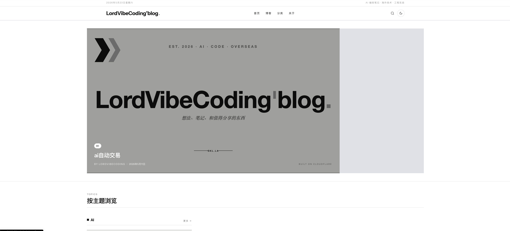
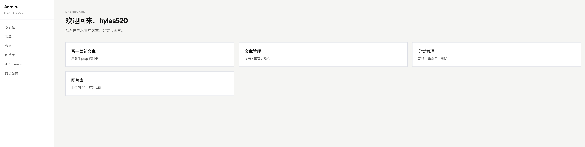

# serverless-cloudflare-blog

我的个人博客 / 资讯站，整站跑在 Cloudflare 边缘网络上，没有任何长进程服务器。Next.js 16 App Router、D1 SQLite、R2 对象存储、Tiptap 富文本、Giscus 评论。

线上：**[okl.la](https://okl.la)**



## 为什么做这个

市面上的博客模板要不是 WordPress 那种重型 CMS，要不是只能写 Markdown 的纯静态站。我想要的是中间：

- 一个能在线点鼠标写文章、能传图、能有评论的**带后台**的博客
- 但又**不要服务器、不要数据库面板、不要每月 5 刀**
- 视觉风格不像 starter 模板，是我自己的资讯杂志感
- API 能让 AI Agent 直接调用发文章（我后续会做这块）

Cloudflare 的 D1 + R2 + Workers 刚好把这几条全满足了，免费层用到天荒地老。

## 它现在能干嘛

**前台**

- 首页大图 hover 切换 + 横向轮播 + 多分类专区
- 无限滚动文章列表（1 大 6 小循环），右侧栏 sticky
- 文章页支持封面、目录、上下篇、相关阅读
- 全站 Cmd+K 搜索（MiniSearch 客户端索引）
- Giscus 评论，用 GitHub 账号登录就能留言
- 暗色模式 / 响应式 / 拼音 slug / 自动 OG 图

**后台**



- Tiptap 富文本，截图直接 ⌘V 自动上传 R2
- 没填封面就拿正文第一张图，没填摘要就截首段
- 分类 / 图片库 / API Token 管理
- 站点设置：站名、标语、关键词、favicon、社交链接、首页 banner 全在后台改

**API**

所有后台操作都暴露成 REST API，用 `Authorization: Bearer lvc_xxx` 调用：

```bash
curl -X POST https://your-domain/api/admin/articles \
  -H "Authorization: Bearer lvc_xxx" \
  -H "Content-Type: application/json" \
  -d '{
    "slug": "hello",
    "title": "标题",
    "bodyHtml": "<p>正文</p>",
    "categorySlug": "ai"
  }'
```

设计上就是给 AI Agent / 自动化脚本调用的：摘要、封面、阅读时长全部服务端自动补全，最小 payload 就能发文。

## 技术栈

- **框架**：Next.js 16 + React 19，App Router，纯 Server Components
- **样式**：Tailwind v3，Instrument Sans + Roboto Slab
- **编辑器**：Tiptap 3（ProseMirror）
- **数据**：Cloudflare D1 (SQLite) + Drizzle ORM
- **存储**：Cloudflare R2，前面挂一个自定义域名
- **认证**：iron-session + PBKDF2，外加 Bearer Token
- **搜索**：MiniSearch（客户端跑，零 API 成本）
- **评论**：Giscus（GitHub Discussions）
- **部署**：`@opennextjs/cloudflare` 打包成单个 Worker

## 本地跑

```bash
git clone https://github.com/LordVibeCoding/serverless-cloudflare-blog.git
cd serverless-cloudflare-blog
pnpm install

# 生成管理员密码 + session secret，输出贴到 .env.local
node scripts/hash-password.mjs 'your-password'

# 本地数据库 + 默认分类
pnpm db:migrate:local
pnpm db:seed

# 起来
pnpm dev
```

打开 http://localhost:3000，后台 http://localhost:3000/admin

## 部署到 Cloudflare

需要先在 Cloudflare 启用 R2（去 dashboard 接受一次条款）。

```bash
# 创建 D1 + R2
wrangler d1 create <your-db-name>
wrangler r2 bucket create <your-bucket-name>
# 把 wrangler.toml 里的 database_id / bucket_name 替换成你自己的

# 应用迁移到远程 D1
pnpm db:migrate:remote

# 上传 secrets
for k in ADMIN_USERNAME ADMIN_PASSWORD_ITER ADMIN_PASSWORD_SALT ADMIN_PASSWORD_HASH SESSION_SECRET; do
  wrangler secret put $k
done

# 构建 + 部署
pnpm cf:deploy
```

域名绑定走 Cloudflare dashboard → Workers → Custom domains，把 `okl.la`、`media.okl.la` 指向 Worker 和 R2。

## 几个值得说的坑

**1. 中文路径下 Turbopack 会 panic**

我的项目目录在 `~/Desktop/其他开发/博客/`，Next 16 默认 Turbopack 切割中文字符串的 byte 边界出 bug。`next dev --webpack` 绕过去了，生产构建不受影响。

**2. CF Workers 的 PBKDF2 最多 100k 次迭代**

本地用 200k 没事，部署后登录全 500。换 100k 是 Workers runtime 限制，文档没明确说。

**3. dotenv 会吃掉 `$` 字符**

密码 hash 用 `pbkdf2-sha256$200000$salt$hash` 这种格式存 env 会被 `$200000` 之类当 shell 变量插值替换。最后改成三个独立变量（ITER / SALT / HASH）。

**4. OpenNext build 阶段 D1 binding 是空的**

任何依赖数据库的 `generateStaticParams`、`prerender` 都得加 try/catch，否则 build 直接挂。

**5. 中文 slug 在 URL 里很难看**

后台输标题后自动转拼音生成 slug（`pinyin-pro`），用户不喜欢可以手改。

## 项目结构

```
src/
├── app/
│   ├── (site)/          前台路由（首页 / 列表 / 详情 / 分类 / 关于）
│   ├── admin/           后台
│   ├── api/             admin CRUD + auth
│   └── sitemap.ts robots.ts rss.xml manifest.ts opengraph-image.tsx
├── components/
│   ├── article/         文章相关组件（卡片 / Hero / 侧栏 / Tiptap）
│   ├── admin/           后台表单
│   ├── search/          Cmd+K 搜索弹窗
│   └── layout/          Header / Footer / Container
├── db/                  Drizzle schema + repo
└── lib/                 auth, seo, upload, site config 等
```

## 开源协议

MIT。fork / 改名 / 商用都行，不需要署名（虽然我看到了会很开心）。

## 一个具体的请求

如果你 fork 之后做了你自己的版本，欢迎在 [Discussions](https://github.com/LordVibeCoding/serverless-cloudflare-blog/discussions) 里贴一下你的站，我想看看大家用同一套底子各自怎么改的。
